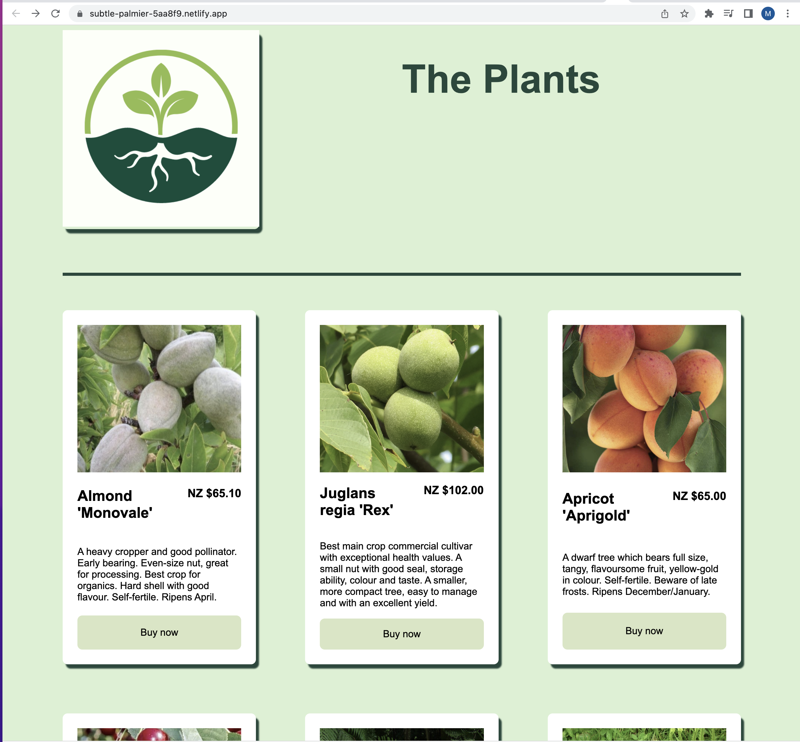
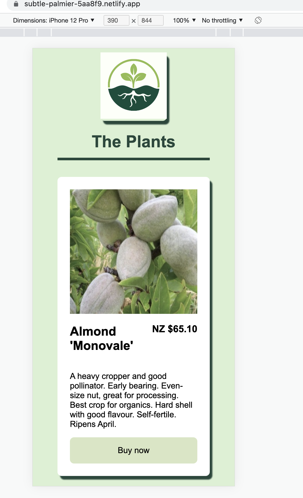

# 01 Project - Online Shop

https://subtle-palmier-5aa8f9.netlify.app/

An online shop that sells plants.

## Dependencies

This project uses the following systems to work properly:

* [Stripe](https://stripe.com/nz)
* [Begin](https://begin.com/)
* [React](https://reactjs.org/)

### Prerequisites

- [Node](https://nodejs.org/en/)

## local development

1. Run npm install

2. Run npm start to start the development server
 
3. Open src/App.js to get started

### Deployed applications

* [Netlify](https://subtle-palmier-5aa8f9.netlify.app/)

* [Begin](https://begin.com/apps/gr6ea76epy4j66)

